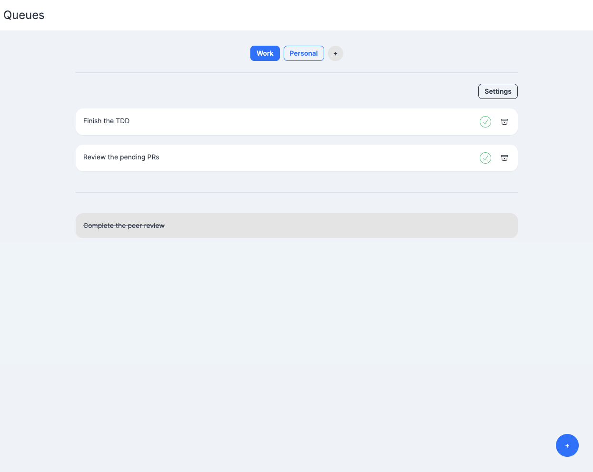

# Welcome to Queues!

Queues is a web application that can be used to manage your daily tasks and
keep track of your daily progress.




## Decisions & Stack

- The app is built with [Remix](https://remix.run/). I wanted to give a try to the framework and live all the end-to-end journey.
- The app uses [Tailwind](https://tailwindcss.com/) to style all the components. I'm a big fan of Tailwind! I have combined it with [daisyUI](https://daisyui.com/) to easily generate some components.
- The app is connected to a [Supabase](https://supabase.io/) database for now.

I will manage authentication there as well. This is a temporal approach, I plan to work on the server side at some point with 
Golang or another new technology to me.

## Development

The app is connected and configured to my Supabase account. You must set up your own Supabase project by
copy the `.env.example` file to `.env` and fill the variables with your own Supabase project.

Once connected, run the dev server:

```shellscript
yarn dev
```

